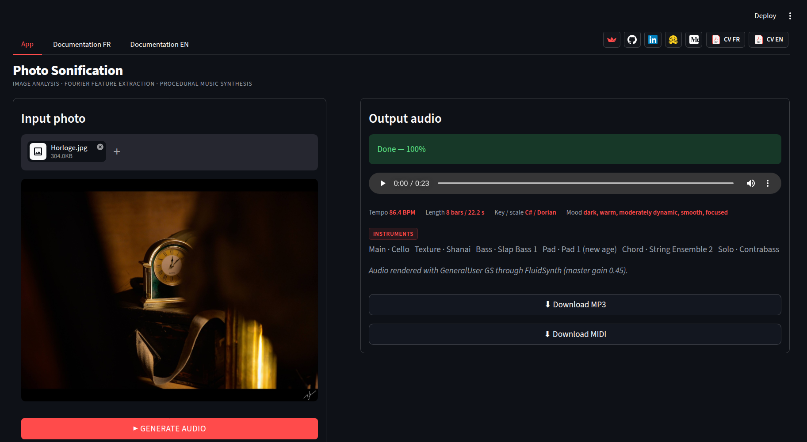

# Photo Sonification

Photo Sonification is an interactive app that converts a still image into a short musical composition.

The project is designed as a portfolio demo at the intersection of image processing, signal processing, procedural audio synthesis and human-readable algorithmic mapping. The app does not use a trained model to recognize the semantic content of the image. It does not try to identify faces, objects, scenes or emotions. Instead, it treats the photo as a two-dimensional signal, extracts measurable visual descriptors, and maps them to musical decisions.

The central idea is simple: the photo is not translated as a sentence; it is read as a signal. The generated music is the trace left by that reading.



## Live demos

Primary version:

- Streamlit app: https://photo-sonification.streamlit.app/

Legacy version:

- Hugging Face Space: https://huggingface.co/spaces/trungtindinh/photo_sonification

The Streamlit version is the main version of the project. The Gradio version is kept as the Hugging Face Space entry point.

## What the app does

Given an input image, the app generates a musical result through a deterministic pipeline:

```text
Input photo
    |
    +-- Image analysis
    |       luminance, contrast, shadows, highlights
    |       contours, texture entropy, symmetry
    |       color descriptors
    |       2D Fourier descriptors
    |       visual saliency
    |
    +-- Musical mapping
    |       key and scale
    |       tempo
    |       number of bars
    |       complexity and variation strength
    |       chord progression
    |       instruments and layer balance
    |
    +-- Event generation
    |       melody
    |       texture
    |       bass
    |       pad
    |       chords
    |       optional saliency-driven solo layer
    |
    +-- Rendering and export
            waveform
            MP3
            MIDI
            analysis plots
```

When the Random Factor is set to zero, the same image and the same parameters produce the same result.

## Main features

- Load a personal image or use the default image.
- Analyze the image through luminance, contrast, shadows, highlights, contours, texture entropy and symmetry.
- Compute Fourier-domain descriptors from the 2D spatial spectrum of the image.
- Estimate visual saliency from low-level image descriptors.
- Convert image descriptors into musical variables such as key, scale, tempo, register, note density and variation strength.
- Generate a multi-layer composition with melody, texture, bass, pad and chord layers.
- Add an optional saliency-driven Solo layer when GeneralUser GS mode is used.
- Choose instruments automatically from image features or manually from the interface.
- Adjust layer gains in decibels.
- Export the generated result as MP3 and MIDI.
- Display photo analysis maps and audio analysis plots.
- Read detailed English and French documentation directly in the app.

## Method overview

Photo Sonification follows an interpretable feature-based approach. The goal is not to produce a random melody from an image. The goal is to preserve a visible connection between image descriptors and musical structure.

The app first converts the image into normalized RGB values and computes a luminance image using perceptual weights:

```text
Y = 0.2126 R + 0.7152 G + 0.0722 B
```

From this luminance image, the app computes brightness, contrast, robust dynamic range, shadow proportion, highlight proportion and spatial centroids. These descriptors influence the global register, bass strength, bright accents and melodic contour.

The app also computes contours from the spatial gradient magnitude. Edge density and texture entropy influence rhythmic density, attacks, complexity and the number of bars.

Symmetry is estimated by comparing the image with its left-right and top-bottom reflections. A symmetric image tends to produce a more stable musical form, while an asymmetric image tends to produce stronger variation.

## Fourier-domain analysis

The image is also analyzed in the Fourier domain. After mean removal and windowing, the app computes a 2D Fourier transform of the luminance image.

The spatial spectrum is divided into low, mid and high frequency regions:

- low frequencies describe large smooth structures;
- mid frequencies describe medium-scale shapes and transitions;
- high frequencies describe contours, fine details, textures and noise.

These descriptors influence sustained layers, bass weight, texture activity, instrument brightness and tempo. A periodic peak score is also computed to detect repeated visual structures such as stripes, grids, windows or regular textures.

## Visual saliency

The app includes a low-level saliency model. Saliency is not semantic: it does not identify the subject of the image. It is computed from contour strength, color rarity, luminance rarity and a weak center bias.

The resulting saliency map is used to place sparse musical accents. In GeneralUser GS mode, the most salient regions can drive an optional Solo layer: horizontal position influences timing, while vertical position influences pitch.

## Musical mapping

The mapping from image to music is deterministic and explicit.

The dominant hue contributes to the tonal center. Brightness and warmth influence scale tendency. Edge density, contrast, high-frequency energy and periodicity influence tempo depending on the selected mapping style.

Available tempo modes are:

- Scientific: stronger dependence on measured image descriptors;
- Balanced: softer descriptor-based mapping;
- Musical: smoother and more conservative tempo behavior;
- Manual: user-selected BPM.

The app uses the number of bars rather than a direct target duration. The automatic bar range is estimated from texture entropy, edge density, high-frequency Fourier energy and periodicity.

## Musical layers

The generated composition is organized into several layers.

| Layer | Role |
|---|---|
| Main | Principal melodic contour derived from image slices |
| Texture | Arpeggios, highlight notes and short rhythmic impulses |
| Bass | Low-frequency harmonic foundation |
| Pad | Sustained harmonic background |
| Chord | Chord hits and harmonic support |
| Solo | Optional saliency-driven melodic accents in GeneralUser GS mode |

This layered structure makes the output closer to a compact composition than to a sequence of isolated notes.

## Instrument synthesis

The app supports two main rendering approaches.

In Simple mode, instruments are synthesized internally with lightweight signal-processing recipes: additive harmonics, inharmonic partials, vibrato, ADSR envelopes, decay laws and noise components.

Typical internal instruments include:

- soft piano;
- music box;
- bright bell;
- celesta;
- kalimba;
- marimba;
- harp;
- synth pluck;
- warm pad;
- glass pad;
- cello-like bass;
- bowed string;
- flute-like lead;
- clarinet-like reed.

In GeneralUser GS mode, the app can use General MIDI programs through FluidSynth and a GeneralUser GS SoundFont. If this backend is not available, the app falls back to the internal Simple synthesis backend while preserving the same musical event structure.

## Random Factor

The Random Factor introduces controlled perturbations before musical generation. It does not replace the image-based mapping by pure randomness.

At zero, the mapping is strictly reproducible. At higher values, the app becomes more exploratory while still preserving the main visual identity of the image.

The photo analysis panel remains based on the original image so that the displayed visual descriptors stay interpretable.

## Repository structure

```text
.
├── app.py                 # Legacy Gradio / Hugging Face Space entry point
├── app_sl.py              # Streamlit entry point
├── ui.py                  # Streamlit interface
├── image_analysis.py      # Image descriptors, Fourier analysis and saliency
├── composition.py         # Musical mapping and note-event generation
├── audio.py               # Audio rendering, synthesis and export utilities
├── config.py              # Constants, defaults and application configuration
├── utils.py               # Shared utility functions
├── documentation_en.md    # Detailed English documentation
├── documentation_fr.md    # Detailed French documentation
├── requirements.txt       # Python dependencies for the Streamlit app
├── packages.txt           # System packages used by online deployment
├── LICENSE.txt            # MIT license
└── README.md              # Repository description
```

## Installation

Clone the repository:

```bash
git clone https://github.com/trungtin-dinh/photo_sonification.git
cd photo_sonification
```

Install the Python dependencies:

```bash
pip install -r requirements.txt
```

The core Python dependencies are used for numerical processing, image manipulation, plotting, audio export and the Streamlit interface.

Some deployment environments also install the system packages listed in `packages.txt`, especially for MP3/audio handling and optional FluidSynth support.

## Run the Streamlit app

The Streamlit app is the main version:

```bash
streamlit run app_sl.py
```

The local interface is usually available at:

```text
http://localhost:8501
```

## Run the legacy Gradio app

The Gradio app is kept mainly for the Hugging Face Space:

```bash
python app.py
```

The local interface is usually available at:

```text
http://127.0.0.1:7860
```

If Gradio is not installed in your local environment, install it before running the legacy app:

```bash
pip install gradio
```

## Hugging Face Space notes

The YAML block at the top of this README is used by Hugging Face Spaces.

This repository currently keeps the Hugging Face Space on the legacy Gradio entry point:

```yaml
sdk: gradio
app_file: app.py
```

Future development is focused on the Streamlit version. The Gradio version is kept for compatibility with the existing Hugging Face deployment.

## Documentation

The repository includes two detailed documentation files:

- `documentation_en.md`: English documentation;
- `documentation_fr.md`: French documentation.

They explain the signal-processing pipeline, image descriptors, Fourier analysis, visual saliency, musical mapping, instrument selection, rendering, Random Factor and limitations.

## Notes and limitations

Photo Sonification is an interpretable feature-based system, not a semantic image-to-music model.

It does not understand the subject of the photo. A mountain, a face and a building can produce similar music if their luminance, texture, color and Fourier descriptors are similar.

The mapping is designed, not learned. This is a strength for transparency and a limitation for aesthetic universality. Another designer could choose different mappings and obtain different musical behavior.

The relation between color and harmony is not a physical law. It is a controlled artistic convention implemented through deterministic rules.

The synthesis backend is intentionally lightweight. It is suitable for an online educational app, but it is not a replacement for professional music production tools.

## License

This project is released under the MIT License. See `LICENSE.txt` for details.

## Author

Developed by Trung-Tin Dinh as part of a portfolio of interactive signal, audio, image and computer vision mini apps.

- GitHub: https://github.com/trungtin-dinh
- Streamlit portfolio: https://share.streamlit.io/user/trungtin-dinh
- LinkedIn: https://www.linkedin.com/in/trung-tin-dinh/ 
- Medium: https://medium.com/@trungtin.dinh
